# IPK - Počítačové komunikace a sítě
## Projekt 2: _Bandwidth Measurement_
### Vypracoval: _Miroslav Válka_

---

##  Obsah
 - [Obsah](#obsah)
 - [Stručné zadání projektu](#zadani)
 - [Měření rychlosti sítě ](#mereni)
   - [Základní pojmy](#zakladni_pojmy)
   - [Možné způsoby měření](#mozne_zpusoby_mereni)
 - [Implementace](#implementace)
 - [Pokusná měření](#testy)
 - [Známé chyby](#chyby)
 - [Bibliografie](#bibliografie)

---

##  Stručné zadání projektu 
- Nastudovat problematiku měření přenosové rychlosti.
- Naprogramujte aplikaci realizující měření přenosové rychlosti mezi dvěma body v síti skrze protokol UDP.
- Proveďte sadu experimentů pro různé prostředí.

##  Měření rychlosti sítě 
###  Základní pojmy
- __Měřící server__
  - Aplikace na jedné straně měření poskytující druhé straně možnost reflexe či jiných služeb.
- __Měřící klient__
  - Aplikace na druhé straně měření, jenž provádí sady testů (posílání dat druhé straně a následné vyhodnocení výsledků).
- __RTT (Round-Trip Time)__
  - Rozdíl času od odeslání prvního bitu příjemci po doručení posledního bitu odpovědi. 
- __Šířka pásma sítě (Bandwidth)__
  - Maximální přenos dat přes danou cestu.

###  Možné způsoby měření
- __Pomocí TCP__
  - TCP samo o sobě upravuje svoji rychlost na základě aktuálních podmínek.
  - Většina testů skrze TCP využívá posílání velkého souboru dat a měření doby za kterou byl přenesen. A využívají se dvě různé techniky __Měření ve stacionárním bodě__ (sada jednorazovích testů - střídání sekvencí Downlink a Uplink s pauzami) a __Měření za jízdy__ _(předem definovaná vzorkovací frekvence i metrika)_.
  - Pomocí TCP nelze spolehlivě měřit __nefunkční sítě__ _(tj. sítě vystavené velké ztrátě paketů nebo velkým odchylkám ve zpoždění mezi doručením paketů)_.
  - Dále může docházet ke zkreslení údajů vlivem __traffic shaping__-u _(omezování rychlosti provozu)_, __traffic pooling__-u _(při monitorování provozu může dojít k překročení povoleného limitu a k následnému omezení rychlosti)_
- __Pomocí UDP__
  - Pro UDP platí podobná omezení a zkreslení jako pro TCP.
  - UDP nemá žádný samoregulující systém rychlosti jako TCP a při přenosů může docházet ke ztrátám dat. Z toho vychází některé postupy.
  - __Nárazové posílání velkého objemu dat__ a počítání počtu příchozích paketů. Pokud budeme posílat data větší než je šířka pásma, tak bude docházet ke znatelným ztrátám paketů
  - __Postupné navyšování objemu dat__. V okamžiku, kdy začne docházet ke znatelným ztrátám dat, tak tato zkutečnost signalizuje překračování dostupné šířky pásma.
  - __Dvousměrné posílání dat s nejvyšší možnou rychlostí__.  Inspirována kombinovaným testem Uplink-Downlikn, kdy jsou opakovaně odesílána data, kdy je výsledná měřená hodnota získána z časových údajů mezi odchozím a příchozím paketem a velikostí přenesených bajtů v paketu paketu. 
- __IPv6__
  - Měření IPv6 a IPv4 nevychází stejně neboť IPv6 je v mnoha ohledech jiné a to například i množstvím dat, které může jeden paket přenést. 

##  Implementace
- Pokusil jsem se implementovat __Dvousměrné posílání dat s nejvyšší možnou rychlostí__.
- Měření nakonec je možné provádět jen na IPv4 sítí.
- Přidal jsem další roli k `meter` a `reflect`a to `help`
  - 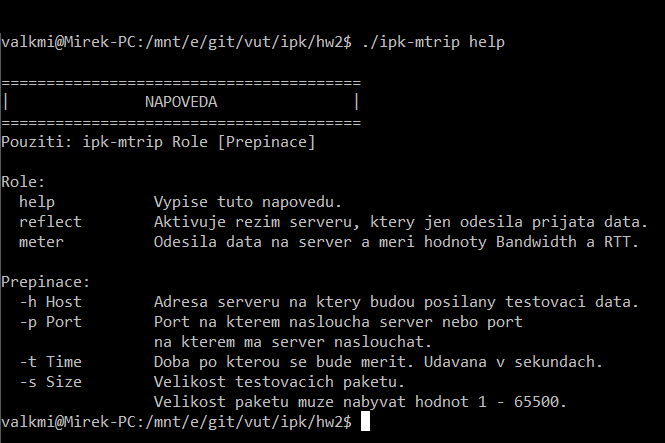
- Pokud mření trvá příliš dlouho je možné aplikaci ukončit zasláním ` SIGINT` (`Ctrl+C`).
  - 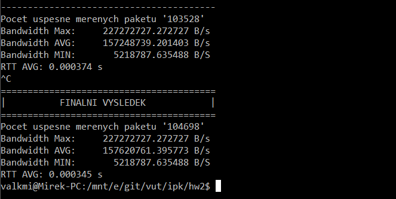
- Pokud server není dostupný nebo se nepodařilo ani jedno měření, tak se nevypíší žádná naměřená data, ale pouze zprava o nedostatku dat.
  - 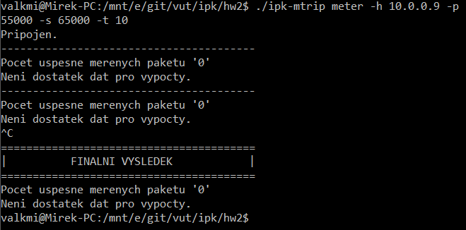

##  Pokusná měření
- Pokusná měření byla prováděná na domácí síti LAN (100Mbit) a WLAN (IEEE 802.11n) a switch (NETGEAR GS308 100/1000Mbit). 
- Použitá zařízení jako server/klient: 
  - WW: __Windows 10 s Ubuntu terminálem__, Eth: 100/1000Mbit, Wifi: IEEE 802.11n 
  - PI: __Raspbian__, Eth: 100Mbit, Wifi: N/A 
  - WE: __Windows 10 s Ubuntu terminálem__, Eth: 100/1000Mbit, Wifi: N/A
- Měření probíhala spuštěním serveru na portu `55000` a klientská aplikace byla spouštěna s parametry `-s 65000 -t 10` _(Velikost dat v paketech 65000B a čas měření 10s)_.

### 1. Měření: WW a WE přímé propojeni skrze switch (1000Mbit).
- Začátek měření __č.1.__
- 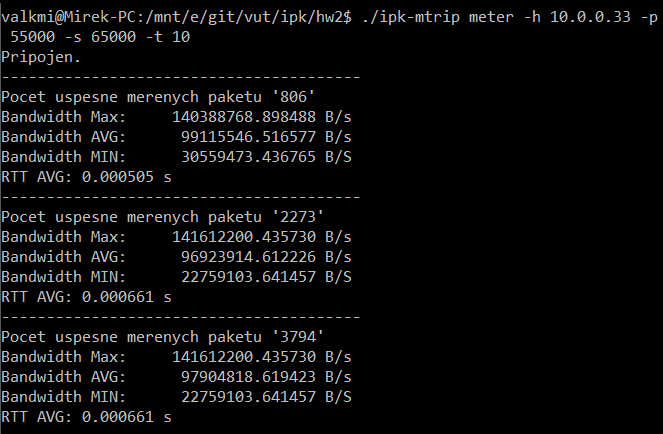
- Konec měření __č.1.__
- 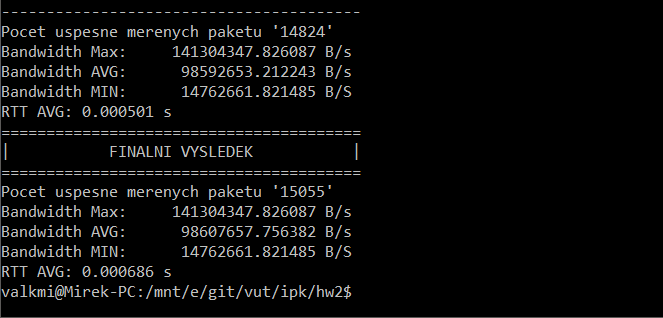

### 2. a 3. Měření: WW a PI propojeni skrze LAN (100Mbit).
- __PI = server__  _X_  __WE = klient__
- Začátek měření __č.2.__
- 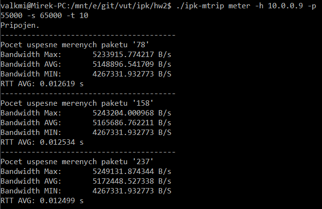
- Konec měření __č.2.__
- 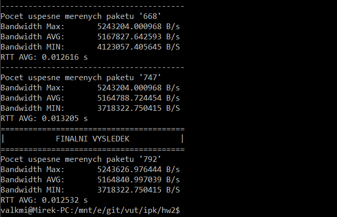
- __WE = server__  _X_  __PI = klient__
- Začátek měření __č.3.__
- 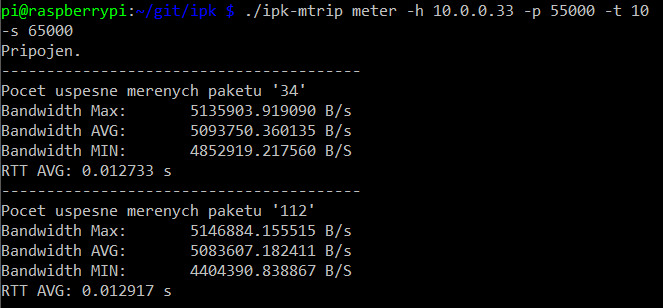
- Konec měření __č.3.__
- 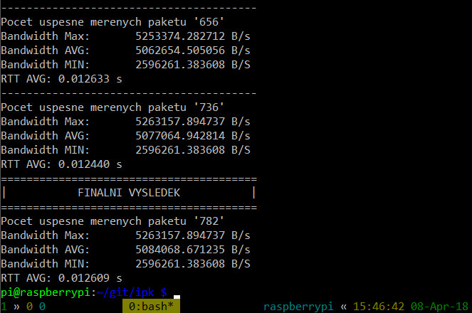

### 4. a 5. Měření: WW a PI propojeni skrze WIFI (IEEE 802.11n) do LAN (100Mbit).
- __WW = server__  _X_  __PI = klient__
-  Začátek měření __č.4.__
- 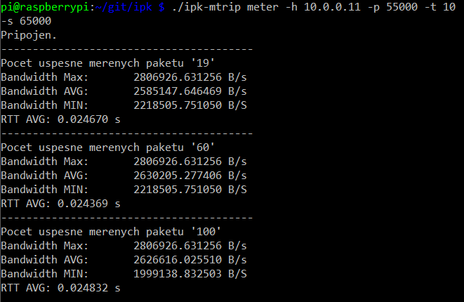
- Konec měření __č.4.__
- 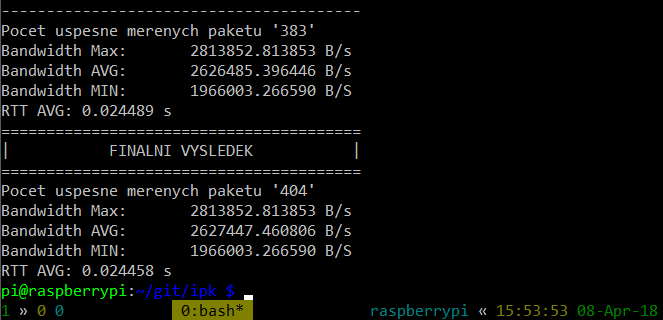
- __PI = server__  _X_  __WW = klient__
- Konec měření __č.5.__
- 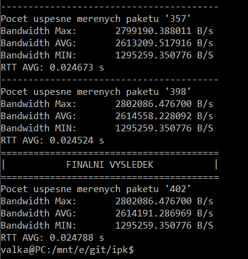

##  Známé chyby 
- Problémy s funkci getopt() pod BSD serverem Eva.
  - Funkce nenačte žádné parametry i když existují.
  - Důvod: Neznámí.
- Server není schopen obsloužit více klientů současně aniž by hrozilo zkreslení měření.
- Není plně implementována podpora měření na IPv6 sítích. (Nenašel jsem způsob jak implementovat překlad jmen na IPv6 aniž by přestala fungovat IPv4 v UDP režimu.)

##  Bibliografie 
- __OSVALD, Bryan__. _Answers: How does TCP round trip time (RTT) estimation work? How different is the implementation across operating systems?_. In: Quora.com[online]. 30.11.2015 [cit.1.4.2018]. Dostupné z: https://www.quora.com/How-does-TCP-round-trip-time-RTT-estimation-work-How-different-is-the-implementation-across-operating-systems
- __FRUNZE Alexey__. _Answer: timeval_subtract explanation_. In: Stack Overflow[online]. 6.4.2013 [cit. 6.4.2018]. Dostupné z: https://stackoverflow.com/questions/15846762/timeval-subtract-explanation
- __watermelon82__ a __Jeremy Friesner__. _C Sockets to Measure Bandwidth_. In: Stack Overflow[online]. 10.1.2017 [cit. 6.4.2018]. Dostupné z: https://stackoverflow.com/questions/41560360/c-sockets-to-measure-bandwidth
- __ČTU__. _Měření datových sítí pomocí TCP protokolu_.[online]. 17.12.2014 [cit. 6.4.2018]. Dostupné z: https://www.ctu.cz/sites/default/files/obsah/stranky/937/soubory/merenidatovychparametrusitipomocitcpprotokolu.pdf 
- __Bc. Jan Franc__. _Metody měření přenosových rychlostí v datových sítích_. [online]. Brno: VUT FEKT, 2010 [6.4.2018]. Dostupné z: https://www.vutbr.cz/www_base/zav_prace_soubor_verejne.php?file_id=29744

